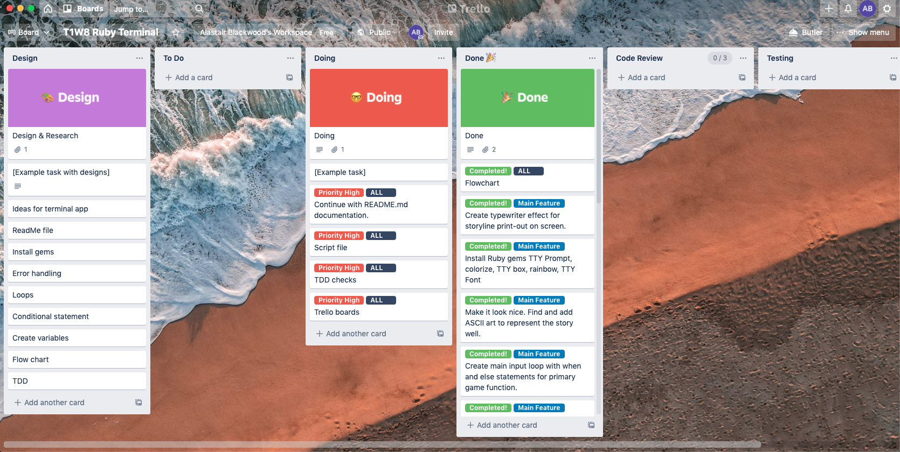

# T1A3 - Terminal Application - Alastair Blackwood

Source control repository can be found here: https://github.com/alastairblackwood/ROR-T1A3

# R4 Software Development Plan

## Description

My terminal application is a game titled 'The Ranger Of Redoc'. It's based on the classic 1980's Fantasy Adventure text based computer games, where the player selects a path they wish to go down which then outputs a new part of the story. The story itself follows the final part of the hero's journey to enter the Forbidden Forest Of Ybur. His mission is to find and destroy the Beast that has terrorized the world for so long, while avoiding death himself and returning safely to his home at the end.

It starts by outputting a welcome message with the game title and then requests the users name. After the user enters their name, the story introduction runs and then the app prompts the user to input 'help' to see a list of possible commands.

The commands it offers are North, South, East, West, Attack and Quit. Selecting North will take the user to a particular area of the story, where they are blocked and have to return South back into the Forest.

Because the application is a game, the problem the user has to solve is simply to reach the end of the game without dying. The reason I chose to develop a game was purely from a place of nostalgia, to re-visit my childhood which was formed through playing text-based terminal application games like The Hobbit. I felt that it would a fun application to make and be a great motivator to see it through to the end.

The target audience is for video gamers of a similar demographic to me (mid 30s early 40s) who also grew up with text based video games and would enjoy the nostalgia of playing a new game that encompasses those elements.

A member of the target audience will use it by downloading the programme and simply have fun playing it.

# R6 Features List

The app contains the following features:

- Main input loop using 'when' and 'else' statements that run the programme based on the users commands.
- A module to contain the different classes.
- Navigation class.
- Methods within the Nav class that return help and command functions.
- Story class that contains an array of stories that are accessed via the main input loop depending on what command the user gives.
- \*\*Ascii art that is printed to the screen to provide visual context to the storylines.
- An animation programme that prints the storyline out in a typewriter format.

The programme utilizes a UI class and a Story class which stores a multitude of methods within in each one that get called upon to either 'return' or 'puts' the content back in the main input loop. These include a help method that outputs the navigation commands to the user.

The game features an input loop which is the heart of the programme and runs from the main.rb file. It uses 'when' and 'else' statements to run through the programme commands, and outputs the storyline and navigation content to the display. Once the story reaches it's conclusion - the conditional control structures 'if' and 'else are used so the loop will execute the 'running = nil' command and the programme will end.

I originally included an error handling feature for the command prompt which uses the 'begin' and 'rescue' features to check for NameError. This was because my initial idea was to get the user to type the commands ("north", "south" etc) themselves into the programme - and my NameError handling would pick up any typos and print the error back to them. However, in order to meet the assignment criteria of using four ruby gems in the programme, later on in development I chose to switch to using TTY Prompt which holds the users hand more and prevents them from making those mistakes. I've kept the error handling code in the nav.rb file in case I decide to go continue developing the code at a later stage and switch back to my original plan.

\*\*Ascii art was sourced from the following website: https://www.asciiart.eu by a variety of artists.

# R7 Outline Of the User Interaction and Experience for App

My guess is that users will choose to interact with the app from a casual perspective, as it's designed for light entertainment and mild problem solving.

The commands are currently very minimal and are explained when the user selects the 'help' command. My hope is that the user will be drawn in to the story and want to explore the different scenarios and outcomes depending on the choices they make. The program will enable them to keep going until they have explored the world thoroughly (their character potentially dying along the way) and exhausted all the options.

Errors will be handled by the application using 'begin' and 'rescue' functions that will primarily pick up NameErrors that output the problem back to the user on screen. This is most likely to occur through the user entering a typo which the programme doesn't recognise - however this problem has largely been resolved by using TTY Prompt for now.

# R8 Control Flow Diagram

# R9 Develop implementation plan: - outlines how each feature will be implemented and a checklist of tasks for each feature

I chose to use Trello for the designing and planning stage of the application so I could visually see and be reminded of what tasks I needed to do and set some mental deadlines for when I would like to to have certain tasks completed by.

I only began to discover the custom fields to estimate how long the task would take as well as priority labels towards the end of the project, but will be utilizing them more heavily in the future.

Below are some examples of my Trello board at different points in the app development. To access my public Trello board for this project please visit: https://trello.com/b/3WqKok4u/t1w8-ruby-terminal

# R10 Instructions for Installation and Use

You will need ruby installed on your computer. Download ruby here https://www.ruby-lang.org/en/ .
You will also need the Bundler gem installed. It comes with the main ruby installation, but if you do not have it on your machine, you can install it with the following command:
gem install bundler. The Ranger Of Redoc requires the following Ruby Gems to run:

TTY Box
TTY Prompt
Rainbow
Pry
TTY Font
Pastel

Fork or clone this repository:

https://github.com/alastairblackwood/ROR-T1A3

to your local computer.
To install the gem(s) required, navigate to the location of the /src folder in repository on your computer, and use the command:

    bundle install

Run the app with:

    ruby main.rb

System/hardware requirements: Intel Mac running OSX 10.12+ (and above).

# R11 Overview / Code Structure

main.rb is the primary code file that controls the flow of the program.

story.rb holds the Story module that contains each separate game narrative in arrays. These are returned via Methods back to the main input loop.

nav.rb holds the navigation and other game function methods inside it. The clear, welcome, help, new line, def not found, end, quit and get command methods can all be called upon in main.rb from here.

ascii.rb holds the ascii art images that take place to offer visual representation of the storyline events for the user and trigger depending on what section of the story the user navigates to. These are called into the input loop via methods.

anim.rb is a typewriter animation effect that outputs the text from the story arrays in a typed format. I used this to slow the journey of the game down and enable the user to become a little more immersed in the storyline.

# R12 Code Overview

The most important parts of my code are: my main input loop (found in main.rb), my nav UI class containing the methods, 'clear', 'help', 'get_cmd' (found in nav.rb) and my story module which contains the story array.

The main input loop primarily uses 'when' statements to determine which output the story array will draw from. These are taken from the 'get_cmd' method found in the UI class which uses TTY Prompt to allow the user to select the actions available to them within the game. If the user selects 'quit' or gets to the end of the game, the main input loop will jump to 'running = nil' and the programme will end. Using an 'else' statement, if anything other than the specific commands are entered, it will output 'Command not understood, please try again'.

The 'clear' method is important as it clears the screen at the start of the programme and outputs the game title in an ascii format - setting the tone.

The 'help' method is where the list of commands the user can use throughout the game are printed out to the screen.

The 'get_cmd' method - while initially taking user input (typing of commands) uses TTY Prompt and is essential for the game to function and interact with. It gives the user the option to select 'North', 'South', 'East' and 'West', 'Help', 'Attack' and 'Quit' - with each one outputting a unique
narrative.

My final piece of code which is essential to the programme is my Story array. It is divided into the sections 'Story_Intro', 'Story_North', 'Story_South', 'Story_West', 'Story_East', 'Story_Player_Dead' and 'Story_Ending'. These output to the user depending on which path they've taken via the games main input loop.

# Ethical Issues

I used Ascii art in my programme but found it difficult to know how to properly attribute the art to the artist who spent the time creating them. This is of course an ethical issue as all artists should receive proper credit for their work so it is something I need to be more considerate of in the future.

# R17 Design TWO tests:

I was sadly unable to design two functional tests for my programme. I attempted to write one below to test my ask method (nav.rb) to check the given user input - to return true or false - however I ran out of time to execute it properly. This will be an area I will look at in greater detail and ensure I understand how to implement it properly moving forward.

    require_relative '../ROR-T1A3/lib/nav.rb'

    describe 'ask method' do
      it 'should check the input given to the    ask method' do
        # result should be true or false
        result = ask("Is this a question", true, )
        # Expect your input to be true if it passes the filter or expect your input to be false if it does not pass
        expect(result).to be(true)
      end
    end

# R19 Utilise developer tools to facilitate the execution of the application:

To run 'The Raider Of Redoc' fork or clone this repository:

https://github.com/alastairblackwood/ROR-T1A3

To execute the programme, please navigate to the folder

    'ROR-T1A3'

and type the following into terminal:

    ./run_ror.sh
