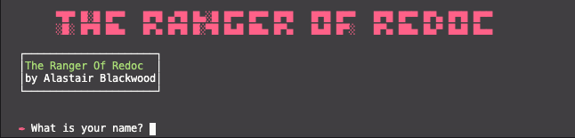

# ROR-T1A3

Source control repository can be found here: https://github.com/alastairblackwood/ROR-T1A3

# R4 Software Development Plan

## Description

My terminal application is a game titled 'The Ranger Of Redoc'. It's based on the classic 1980's Fantasy Adventure text based computer games, where the player selects a path they wish to go down which then outputs a new part of the story. The story itself follows the final part of the hero's journey to enter the Forbidden Forest Of Ybur. His mission is to find and destroy the Beast that has terrorized the world for so long, while avoiding death himself and returning safely to his home at the end.

It starts by outputting a welcome message with the game title and then requests the users name. After the user enters their name, the story introduction runs and then the app prompts the user to input 'help' to see a list of possible commands.

The commands it offers are North, South, East, West, Attack and Quit. Selecting North will take the user to a particular area of the story, where they are blocked and have to return South back into the Forest.

Because the application is a game, there is no specific problem it will solve, other than boredom for the player, through providing a source of entertainment. The reason I chose to develop a game was purely from a place of nostalgia, to re-visit my childhood which was formed through playing text-based terminal application games like The Hobbit. I felt that it would a fun application to make and be a great motivator to see it through to the end.

The target audience is for video gamers of a similar demographic to me (mid 30s early 40s) who also grew up with text based video games and would enjoy the nostalgia of playing a new game that encompasses those elements.

A member of the target audience will use it by downloading the programme and simply have fun playing it.

# R6 Three Features

## Variables concept of variable scope

The programme utilizes a UI class, which stores a multitude of methods within in it that get called upon in the main input loop. These include a help method that outputs the navigation commands to the user.

The first feature of the game uses the variable concept

## Loops and conditional control

The game features an input loop which is the heart of the programme and runs from the main.rb file. It uses 'when' and 'else' statements to run through the programme commands, and outputs the storyline and navigation content to the display. Once the story reaches it's conclusion - the conditional control structures 'if' and 'else are used so the loop will execute the 'running = nil' command and the programme will end.

## Error handling

I've included some error handling features for some of the methods. This primarily uses the NameError and uses the rescue and begin functions and is used to assist in checking that no typos are found and to help the user understand

## Code Structure

main.rb is the primary code file that controls the flow of the program.

story.rb holds the Story module that contains each separate game narrative in arrays. These are returned via Methods back to the main input loop.

nav.rb holds the navigation and other game function methods inside it. The clear, welcome, help, new line, def not found, end, quit and get command methods can all be called upon in main.rb from here.

ascii.rb holds the ascii art images that take place to offer visual representation of the storyline events for the user and trigger depending on what section of the story the user navigates to. These are called into the input loop via methods.

anim.rb is a typewriter animation effect that outputs the text from the story arrays in a typed format. I used this to slow the journey of the game down and enable the user to become a little more immersed in the storyline.

# R7 Outline Of the User Interaction and Experience for App

I would like to add some documentation that explains the navigation commands, however, I have also included that within the programme itself when the user selects (TTY Prompt) or types 'help'.

The commands are very minimal / simple so it would be very difficult to not interact with it easily. The user will probably take great interest in the story and want to explore the different outcomes depending on which direction they take until they have explored the world thoroughly and exhausted all the options.

Errors will be handled by the application by

# R8 Control Flow Diagram

# R9 Develop implementation plan: - outlines how each feature will be implemented and a checklist of tasks for each feature

I chose to use Trello for the designing and planning stage of the application and set some deadlines for when I would like to to have a task completed by and to move on the next task.

- prioritise the implementation of different features, or checklist items within a feature
- provide a deadline, duration or other time indicator for each feature or checklist/checklist-item

> Your checklists for each feature should have at least 5 items.

# R10 Instructions for Installation and Use

You will need ruby installed on your computer. Download ruby here.
You will also need the Bundler gem installed. It comes with the main ruby installation, but if you do not have it on your machine, you can install it with the following command:
gem install bundler. The Ranger Or Redoc requires the following Ruby Gems to run:

TTY Box
TTY Prompt
Rainbow
Pry
TTY Font
Pastel

Fork or clone this repository:

https://github.com/alastairblackwood/ROR-T1A3

to your local computer.
To install the gem(s) required, navigate to the location of the /src folder in repository on your computer, and use the command:

bundle install

Run the app with:
ruby main.rb

System/hardware requirements: Intel Mac running OSX 10.12+ (and above).

# R17 Design TWO tests:

Each test should:

- cover a different feature of the application
- state what is being tested
- provide at least TWO test cases and the expected results for each test case

> An outline of the testing procedure and cases should be included with the source code of the application

# R19 Utilise developer tools to facilitate the execution of the application:

For example,

- writing a script which turns the application into an executable; OR
- packaging the application for use as a module or dependency
  instructions for Installation and Use

Using the Ruby gem 'Ocra'
